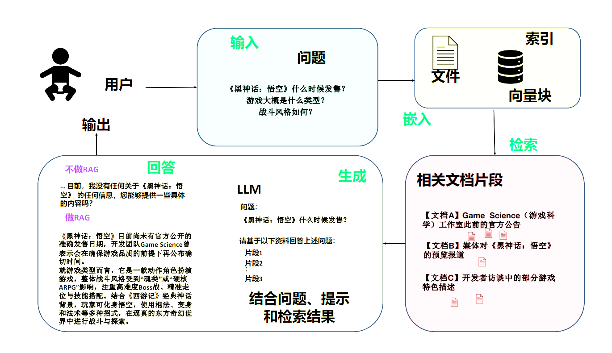
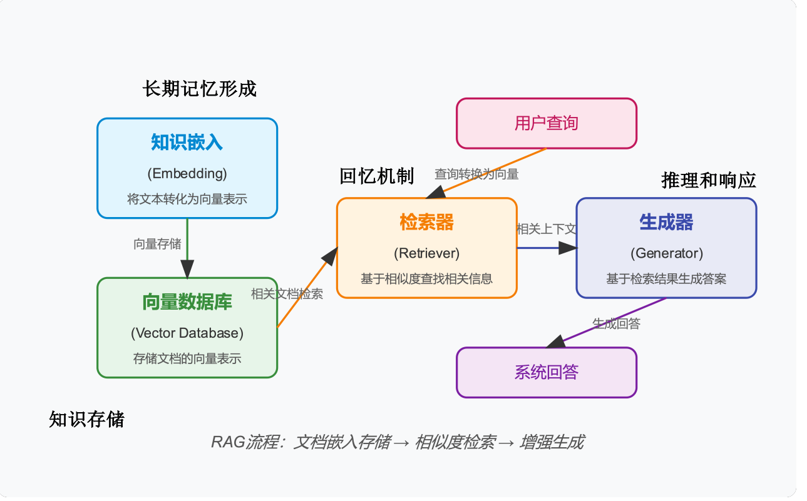

## 1. 基本概念

**RAG（Retrieval-Augmented Generation，检索增强生成）** 是一种结合了 **信息检索** 和 **文本生成技术** 的先进AI框架，旨在提升模型生成内容的准确性、事实性和可解释性。它通过动态检索外部知识库为生成过程提供支持，解决了传统大语言模型（如GPT）存在的“幻觉”（生成虚构信息）、知识更新滞后等问题。凡是如何有效进行  **信息检索**  相关的技术都可以称作 **RAG**。

## 2. RAG的经典架构与流程

## 3. RAG应用的技术架构

### 3.1 四大核心组件

   1. **知识嵌入（Embedding）**：负责将文本知识转化为向量表示，捕捉语义信息。
   2. **向量数据库（Vector DB）**：存储由知识嵌入模块生成的向量表示。
   3. **检索器（Retriever）**：接收用户查询并将其转化为向量，然后从向量数据库中检索相似的文档。
   4. **生成器（Generator）**：基于检索到的相关上下文信息生成流畅且可信的回答。

### 3.2 两个关键环节  

   在通常情况下，可以把开发一个简单的RAG应用从整体上分为 **数据索引** 和 **数据查询** 两个大的阶段，每个阶段都包含不同的处理阶段。

   1. **数据索引阶段**

      

      - **加载（Load）**：将 RAG 需要的知识内容加载到系统中，这些知识可能以结构化、半结构化或非结构化形式存在，如互联网文档、企业内部问答对等。

      - **分割（Split）**：将较大的知识内容分割成较小的片段，以便后续检索和处理。

      - **嵌入（Embed）**：使用嵌入模型将文本、图像、音频等信息转换为高维向量，保留语义关系。嵌入模型将复杂信息表示为向量，使得计算机能够理解和处理这些信息。

      - **存储（Store）**：将嵌入后的向量存储到索引中，以便快速检索。常见的索引形式是向量存储索引，通过计算查询词与已有信息向量的相似度（如余弦相似度），找到语义上最相近的数据块。

        

  2. **数据查询阶段**

     

     - **检索（Retrieve）**： 使用数据索引（如向量存储索引）进行检索，根据语义相似度（如余弦相似度）对检索结果进行排序，输出与查询最相关的知识块，为生成阶段提供上下文信息。
     - **生成（Generation）**： 生成器将检索到的知识块与用户问题结合，使用精心设计的提示词（Prompt）引导大模型生成内容并输出最终结果。

## 4. RAG与微调的选择

| 特点 | RAG (检索增强生成) | 微调 (Fine-tuning) |
|---|---|---|
| **优点** | 1. 使用更灵活，可根据需要随时调整 Prompt 以获得期望输出。 2. 技术上更简单。 3. 可以输入知识增强的 Prompt 让大模型立即适应领域知识。 4. 无额外的训练成本。 | 1. 大模型自身拥有特定知识的输出能力，或适应特定的输出格式。 2. 对下游应用更友好，在特定的任务中使用更简单。 3. 可以节约推理阶段使用的 token，推理成本更低。 |
| **缺点** | 1. 容易受限于上下文窗口的大小。 2. 输入本地知识增强的 Prompt 在实现上下文连续对话时较困难。 3. 大模型输出的不确定性在高准确性的场景中会增加失败概率。 4. 输入带有上下文的、较长的 Prompt 会带来较高的推理成本。 5. 随着模型的迭代，可能需要重新调整 Prompt。 | 1. 非开箱即用。 2. 需要额外的数据准备、标注、清洗成本，以及必要的算力与训练成本。 3. 需要足够的技术专家，特别是机器学习（Machine Learning, ML）专家、数据专家。 4. 微调无法阻止出现"幻觉"问题，过度微调甚至可能导致某些能力下降。 5. 模型迭代周期长，对实时性要求高的知识并不适用。 |

