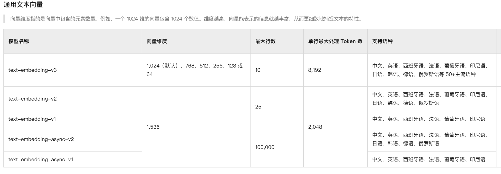

## 一、python虚拟运行环境

### 1. 安装Miniconda

Windows 系统安装步骤
1. 下载 Miniconda 安装包

   - 访问官方下载页面：https://docs.conda.io/projects/miniconda/en/latest/
   - 选择 Windows 版本的安装包（根据系统选择 64位/32位）
2. 运行安装程序

   - 双击下载的安装文件（例如：Miniconda3-latest-Windows-x86_64.exe）
   - 建议安装时选择"仅为当前用户安装"
3. 验证安装是否成功：
   ```bash
   # 打开命令提示符或 PowerShell，输入：
   conda --version
   ```


Linux/MacOS 系统安装步骤：
1. 下载安装脚本：
   ```bash
   # Linux
   wget https://repo.anaconda.com/miniconda/Miniconda3-latest-Linux-x86_64.sh
   
   # MacOS
   wget https://repo.anaconda.com/miniconda/Miniconda3-latest-MacOSX-x86_64.sh
   ```

2. 运行安装脚本：
   ```bash
   # Linux
   bash Miniconda3-latest-Linux-x86_64.sh
   
   # MacOS
   bash Miniconda3-latest-MacOSX-x86_64.sh
   ```

3. 初始化 conda：
   ```bash
   source ~/.bashrc  # Linux
   source ~/.zshrc   # MacOS
   ```

### 2. 验证安装
   ```bash
   # 验证 conda 版本
   conda --version
   
   # 验证 conda 环境
   conda info
   
   # 更新 conda 到最新版本
   conda update conda
   ```

### 3. 搭建虚拟运行环境
   ```bash
   # 创建新的虚拟环境
   conda create -n rag python=3.11
   
   # 激活虚拟环境
   conda activate rag
   
   # 查看当前环境列表
   conda env list
   ```

### 4. 安装项目依赖
   ```bash
   # 进入项目依赖requirements_XXX.txt所在目录执行
   pip install -r requirements_XXX.txt
   ```

## 二、基础大模型

### 1. 通过API访问云端商业模型

#### 1. GPT国内代理
  - [https://www.apiyi.com/](https://www.apiyi.com/)
  - [https://2233.ai/api](https://2233.ai/api)
  - [https://www.eylink.cn/](https://www.eylink.cn/)
    
    如果是自己购买的三方openai代理, 诸如在 https://www.apiyi.com/ 上购买的，可以用
      ``` python
         from openai import OpenAI
         
         client = OpenAI(
             api_key="YOUR_API_KEY",
             base_url="https://vip.apiyi.com/v1"
         )
         
         completion = client.chat.completions.create(
             model="gpt-4o",
             messages=[
                 {"role": "user", "content": "write a haiku about ai"}
             ]
         )
      ```
     如果是自己购买的三方openai代理, 诸如在 https://www.eylink.cn/ 上购买的，可以用
      ``` python
         client = OpenAI(
           base_url=' https://gtapi.xiaoerchaoren.com:8932/v1'
         )
      ```
     如果是自己购买的三方openai代理, 诸如在 https://2233.ai/api 上购买的，可以用
      ``` python
         client = OpenAI(
           base_url=' https://api.gptsapi.net/v1'
         )
      ```

#### 2. OpenAI API使用国内的DeepSeek或通义千问
   ``` python
      # OpenAI 客户端调用
      from openai import Client
      
      # 创建 OpenAI 客户端
      openai = OpenAI()
      
      # OpenAI API调用（代理方式）
      openai = OpenAI(
           api_key="XXX", 
           base_url="https://vip.apiyi.com/v1"
      )
      
      # 阿里云百炼大模型
      client = OpenAI(
         api_key="sk-xxx", 
         base_url="https://dashscope.aliyuncs.com/compatible-mode/v1",
      )

      response = client.chat.completions.create(
         model="qwen-plus", # 模型列表：https://help.aliyun.com/zh/model-studio/getting-started/models
         messages=[
            {'role': 'system', 'content': 'You are a helpful assistant.'},
            {'role': 'user', 'content': '你是谁？'}
         ]
      )
      print(response.choices[0].message.content)

      
      # DeepSeek API调用（deepseek-chat）
      client = OpenAI(
           api_key="XXX",
           base_url="https://api.deepseek.com"
      )
      
      response = client.chat.completions.create(
	      model="deepseek-chat",
	      messages=[
	        {"role": "system", "content": "You are a helpful assistant"},
	        {"role": "user", "content": "Hello"},
         ],
	      max_tokens=1024,
	      temperature=0.7,
	      stream=False
	   )
	   print(response.choices[0].message.content)


   ```

- 自行注册阿里云百炼或DeepSeek账号后，获取API KEY，代码中进行替换
  - DeepSeek：https://api-docs.deepseek.com/zh-cn/
  - 阿里云百炼：https://bailian.console.aliyun.com

### 2. 基于Ollama部署本地开源大模型
   #### 1. 安装 Ollama
   
   Windows 系统安装
   1. 下载 Ollama 安装包
      - 访问官方下载页面：https://ollama.com/download
      - 下载 Windows 版本的安装包
   
   2. 运行安装程序
      - 双击下载的安装文件
      - 按照安装向导完成安装
   
   3. 验证安装
      ```bash
      # 打开 PowerShell 或命令提示符，输入：
      ollama --version
      ```

   Linux/MacOS 系统安装
   ```bash
   # 使用 curl 安装
   curl -fsSL https://ollama.com/install.sh | sh
   
   # 验证安装
   ollama --version
   ```
   #### 2. 下载 Qwen2.5 模型
   在下载模型之前，请根据您的硬件配置选择合适的模型版本：
   1. **硬件配置与模型选择**
      - 低配置（8GB内存）：建议使用 Qwen2.5 1.8B 或 4B 版本
      - 中等配置（16GB内存）：可以使用 Qwen2.5 7B 版本
      - 高配置（32GB+内存）：可以使用 Qwen2.5 14B 或更大版本
   3. **模型版本说明**
      - 1.8B：轻量级版本，适合入门和测试
      - 4B：平衡版本，适合一般应用
      - 7B：标准版本，适合大多数应用场景
      - 14B：高性能版本，需要更好的硬件支持
   5. **量化版本选择**
      - 如果内存有限，可以选择量化版本（如 qwen2.5:7b-q4）
      - 量化版本会降低一些性能，但能显著减少内存占用

   ```bash
   # 查看可用的模型版本
   ollama list
   
   # 拉取适合的模型版本（示例）
   ollama pull qwen2.5:7b  # 标准版本
   ollama pull qwen2.5:7b-q4  # 量化版本
   ```
   #### 3. 运行模型
   - 基础运行
      ```bash
      # 启动模型进行对话
      ollama run qwen2.5:7b
      ```

   - 使用 API 接口
      ```bash
      # 启动 Ollama 服务
      ollama serve
      
      # 在另一个终端中使用 curl 测试 API
      curl http://localhost:11434/api/generate -d '{
        "model": "qwen2.5:7b",
        "prompt": "你好，请介绍一下你自己"
      }'
      ```
   
   #### 4. 常用参数配置
   - 运行参数
      ```bash
      # 使用特定参数运行模型
      ollama run qwen2.5:7b --temperature 0.7 --top-p 0.9
      ```
   
   - 常用参数说明：
     - `--temperature`: 控制输出的随机性（0-1）
     - `--top-p`: 控制输出的多样性（0-1）
     - `--num-predict`: 控制生成的最大 token 数
     - `--seed`: 设置随机种子，用于复现结果    
   
   #### 5. 模型管理
      ```bash
      # 查看已安装的模型
      ollama list
      
      # 删除模型
      ollama rm qwen2.5:7b
      
      # 复制模型
      ollama cp qwen2.5:7b qwen2.5:7b-backup
      ```

   #### 6. 进阶使用
   - 使用 Python 调用
     ```python
      import requests
      
      def query_ollama(prompt):
          response = requests.post(
              'http://localhost:11434/api/generate',
              json={
                  'model': 'qwen2.5:7b',
                  'prompt': prompt
              }
          )
          return response.json()
      
      # 使用示例
      result = query_ollama("你好，请介绍一下你自己")
      print(result)
     ```
   - 使用 LangChain 集成
      ```python
      from langchain.llms import Ollama
      
      llm = Ollama(model="qwen2.5:7b")
      response = llm("你好，请介绍一下你自己")
      print(response)
      ``` 

## 三、嵌入模型

### 1. 通过API访问云端嵌入模型
   如果我们已经开通了通义千问与OpenAI大模型的API服务，可以直接使用通义千问与OpenAI的嵌入模型。
   下面图片中是通义千问官方公布的支持的嵌入模型。
   

### 2. 基于Ollama部署本地嵌入模型
   之前借助Ollama部署了本地开源大模型，同样可以使用Ollama部署嵌入模型来提供向量生成服务。
   ```bash
      # 拉取适合的模型 并启动服务
      ollama pull milkey/dmeta-embedding-zh:f16
      ollama serve

      # 测试能否正确生成文本向量
      curl http://localhost:11434/api/embeddings -d '{
        "model": "all-minilm",
        "prompt": "Here is an article about llamas..."
      }'

   ```
   
## 四、向量库

### 1. 安装Chroma

Chroma是一个开源的向量数据库，支持嵌入式使用和Client/Server模式。以下是详细的安装和使用说明：

#### 1. 安装Chroma
```bash
# 使用pip安装Chroma
pip install chromadb

# 如果需要使用Client/Server模式，还需要安装chromadb-client
pip install chromadb-client
```

#### 2. 嵌入式使用方式
嵌入式使用方式适合单机应用，数据直接存储在本地：

```python
import chromadb
from chromadb.config import Settings

# 创建本地持久化存储
client = chromadb.PersistentClient(path="./chroma_db")

# 创建或获取集合
collection = client.get_or_create_collection(
    name="my_collection",
    metadata={"hnsw:space": "cosine"}  # 使用余弦相似度
)

# 添加文档
collection.add(
    documents=["文档1的内容", "文档2的内容"],
    metadatas=[{"source": "doc1"}, {"source": "doc2"}],
    ids=["id1", "id2"]
)

# 查询相似文档
results = collection.query(
    query_texts=["查询内容"],
    n_results=2
)
```

#### 3. Client/Server模式
Client/Server模式适合分布式应用，可以支持多客户端访问：

1. 启动Chroma服务器：
```bash
# 安装chromadb-server
pip install chromadb-server

# 启动服务器
chroma run --path ./chroma_db --port 8000
```

2. 客户端使用：
```python
import chromadb
from chromadb.config import Settings

# 创建远程客户端
client = chromadb.HttpClient(
    host="localhost",
    port=8000
)

# 创建或获取集合
collection = client.get_or_create_collection(
    name="my_collection",
    metadata={"hnsw:space": "cosine"}
)

# 添加文档
collection.add(
    documents=["文档1的内容", "文档2的内容"],
    metadatas=[{"source": "doc1"}, {"source": "doc2"}],
    ids=["id1", "id2"]
)

# 查询相似文档
results = collection.query(
    query_texts=["查询内容"],
    n_results=2
)
```

#### 4. 常用配置选项
- `path`: 数据库存储路径
- `hnsw:space`: 向量空间距离度量方式（cosine/l2/ip）
- `hnsw:construction_ef`: 构建索引时的搜索范围
- `hnsw:search_ef`: 搜索时的搜索范围

#### 5. 性能优化建议
1. 对于大规模数据，建议使用Client/Server模式
2. 根据实际需求选择合适的向量空间距离度量方式
3. 调整hnsw参数以平衡查询速度和准确性
4. 定期清理不需要的集合以释放资源

